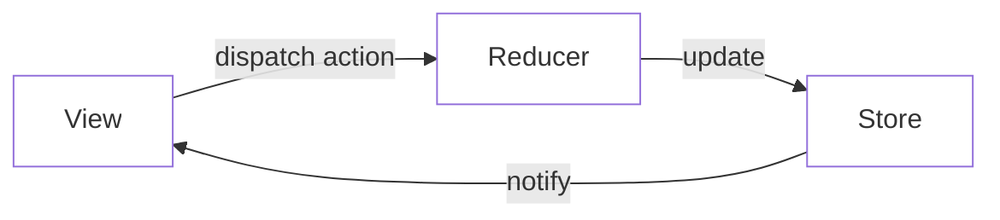
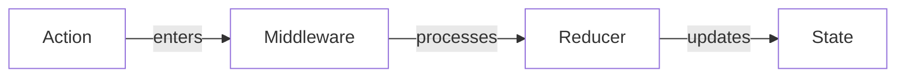
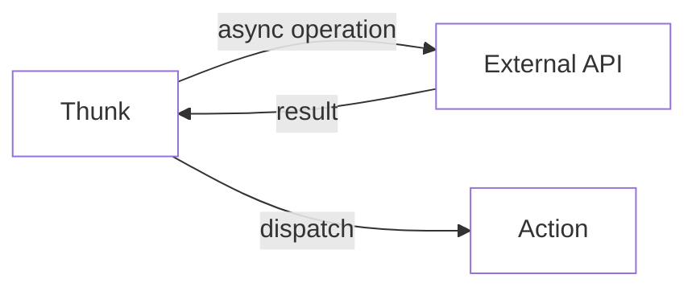

# Unity.AI.Generators.Redux

A lightweight and powerful Redux implementation for Unity, designed to manage application state in a predictable way.

## Introduction

Unity.AI.Generators.Redux is an opinionated state management library for Unity editor tools and game authoring interfaces. It helps you write UI applications that behave consistently, are easy to test, and scale well with complexity.

### When Should You Use Redux?

Redux helps you deal with shared state management, but like any tool, it has tradeoffs. Consider using Redux when:

- You have complex editor UI state that needs to be shared across multiple panels
- Your tool needs to maintain undo/redo history
- You need to synchronize multiple views of the same data
- You have complex validation and error states
- You need to track user interactions and tool state over time

### Quick Start

Here's a small example of managing a prompt generation panel:

```csharp
// 1. Define your state
public record PromptPanelState(
    string PromptText,
    bool IsGenerating,
    List<string> RecentPrompts,
    ValidationState Validation
);

public record ValidationState(bool IsValid, string[] Errors);

// 2. Create a store with a slice
var store = new Store();
var promptSlice = store.CreateSlice(
    name: "promptPanel",
    initialState: new PromptPanelState(
        PromptText: "",
        IsGenerating: false,
        RecentPrompts: new(),
        Validation: new(true, Array.Empty<string>())
    ),
    reducers: builder =>
    {
        builder
            .AddCase("UPDATE_PROMPT", (state, action) => 
            {
                var text = (string)action.payload;
                var errors = ValidatePrompt(text);
                return state with { 
                    PromptText = text,
                    Validation = new(errors.Length == 0, errors)
                };
            })
            .AddCase("START_GENERATION", (state, _) =>
                state with { IsGenerating = true })
            .AddCase("GENERATION_COMPLETE", (state, _) =>
                state with { 
                    IsGenerating = false,
                    RecentPrompts = state.RecentPrompts.Prepend(state.PromptText).Take(5).ToList()
                });
    }
);

// 3. Subscribe to changes to update UI
store.Subscribe<PromptPanelState>("promptPanel", state => 
{
    promptField.value = state.PromptText;
    generateButton.SetEnabled(!state.IsGenerating && state.Validation.IsValid);
    errorContainer.style.display = state.Validation.IsValid ? DisplayStyle.None : DisplayStyle.Flex;
    errorLabel.text = string.Join("\n", state.Validation.Errors);
});

// 4. Dispatch actions from UI events
promptField.RegisterValueChangedCallback(evt => 
    await store.DispatchAction(new StandardAction("UPDATE_PROMPT", evt.newValue)));

generateButton.clicked += async () => 
{
    await store.DispatchAction(new StandardAction("START_GENERATION"));
    try 
    {
        await GenerateImage();
        await store.DispatchAction(new StandardAction("GENERATION_COMPLETE"));
    }
    catch 
    {
        await store.DispatchAction(new StandardAction("GENERATION_ERROR"));
    }
};
```

## What is Redux?

Redux is a pattern for managing application state that follows three fundamental principles:

1. **Single Source of Truth**: The entire application state is stored in a single, centralized store.
2. **State is Read-Only**: The only way to change state is by emitting actions, which describe what happened.
3. **Changes are Made with Pure Functions**: Reducers are pure functions that take the previous state and an action to determine the next state.

### Basic Data Flow


### Action Processing


### Side Effects


### Why Redux?

- **Predictable State Updates**: Actions flow through a standardized pipeline, making state changes traceable and debuggable
- **Centralized Logic**: Business logic lives in reducers and middleware, not scattered throughout your components
- **Performance**: Efficient updates through immutable state patterns and precise change subscriptions
- **Developer Experience**: Time-travel debugging, state persistence, and powerful dev tools
- **Scalability**: Clear patterns for managing growing application complexity

## Features

- Centralized state management
- Immutable state updates through reducers
- Support for middleware and side effects
- Built-in thunk middleware for async operations
- Type-safe state slices
- UI Element bindings
- Efficient state change subscriptions

## Core Concepts

### Store Configuration

The store is the heart of your Redux application. It maintains the state tree and handles the dispatching of actions. Here's a detailed look at store configuration:

```csharp
// Basic store with default configuration
var store = new Store();

// Store with custom initial state
var store = new Store(new CustomReduxState());

// Store with middleware
var store = new Store();
store.ApplyMiddleware(
    LoggerMiddleware,
    AnalyticsMiddleware,
    CustomMiddleware
);

// Store with state validation (development)
var store = new Store(validateState: state => {
    if (state.player.Health < 0)
        throw new ArgumentException("Health cannot be negative");
});
```

### State Structure

Redux uses a single state tree, but that doesn't mean all your state goes into one big object. Instead, use slices to organize state logically:

```csharp
// Domain-specific state types
public record GameState(
    PlayerState Player,
    InventoryState Inventory,
    QuestState Quests
);

// Slice-specific state
public record InventoryState(
    ImmutableArray<ItemStack> Items,
    int MaxSlots,
    float TotalWeight
);

// Create multiple slices
var playerSlice = store.CreateSlice("player", new PlayerState(...));
var inventorySlice = store.CreateSlice("inventory", new InventoryState(...));
var questSlice = store.CreateSlice("quests", new QuestState(...));
```

#### State Design Guidelines

1. **Keep it Serializable**
   ```csharp
   // Good ✓
   public record WeaponState(
       string Id,
       float Damage,
       Vector3 Position
   );

   // Bad ✗
   public record WeaponState(
       GameObject WeaponObject, // Non-serializable
       UnityAction OnFire      // Non-serializable
   );
   ```

2. **Normalize Complex Data**
   ```csharp
   // Good ✓
   public record GameState(
       Dictionary<string, PlayerState> Players,
       Dictionary<string, ItemState> Items
   );

   // Bad ✗
   public record GameState(
       List<PlayerState> Players, // Nested, harder to update specific players
       List<ItemState> Items      // Nested, harder to update specific items
   );
   ```

3. **Minimize State Duplication**
   ```csharp
   // Good ✓
   public record UiState(string SelectedPlayerId);
   public record GameState(Dictionary<string, PlayerState> Players);

   // Bad ✗
   public record UiState(PlayerState SelectedPlayer); // Duplicates player data
   ```

### Actions in Depth

Actions are payloads of information that send data from your application to your store. They are the only source of information for the store. Here's a detailed look at actions:

```csharp
// Standard actions
await store.DispatchAction(new StandardAction("PLAYER_MOVE", new Vector3(1, 0, 0)));

// Action with multiple parameters
await store.DispatchAction(new StandardAction("ITEM_PICKUP", new {
    ItemId = "potion_123",
    Quantity = 1,
    Position = Vector3.zero
}));

// Action creators
StandardAction CreateMoveAction(Vector3 position) => 
    new StandardAction("PLAYER_MOVE", position);

await store.DispatchAction(CreateMoveAction(new Vector3(1, 0, 0)));
```

### Reducers and Immutability

Reducers are pure functions that take the previous state and an action, and return the next state. They are the only place where state updates should occur.

#### Writing Reducers

```csharp
// Basic reducer pattern
var slice = store.CreateSlice(
    name: "inventory",
    initialState: new InventoryState(new(), 20),
    reducers: builder =>
    {
        builder
            // Simple state update
            .AddCase("INCREASE_CAPACITY", (state, action) =>
                state with { MaxSlots = state.MaxSlots + (int)action.payload })
            
            // Complex state transformation
            .AddCase("ADD_ITEM", (state, action) =>
            {
                var item = (ItemStack)action.payload;
                var newItems = state.Items.ToDictionary(
                    kvp => kvp.Key,
                    kvp => kvp.Value
                );
                
                if (newItems.ContainsKey(item.Id))
                    newItems[item.Id] = newItems[item.Id] with { 
                        Quantity = newItems[item.Id].Quantity + item.Quantity 
                    };
                else
                    newItems[item.Id] = item;
                
                return state with { Items = newItems };
            });
    }
);
```

#### Reducer Guidelines

1. **Keep Reducers Pure**
   ```csharp
   // Good ✓
   .AddCase("DAMAGE_PLAYER", (state, action) =>
       state with { Health = Math.Max(0, state.Health - (int)action.payload) })

   // Bad ✗ - Side effects in reducer
   .AddCase("DAMAGE_PLAYER", (state, action) => {
       PlayDamageSound();  // Side effect!
       return state with { Health = state.Health - (int)action.payload };
   })
   ```

2. **Never Mutate State**
   ```csharp
   // Good ✓ - Creates new collections
   .AddCase("ADD_BUFF", (state, action) =>
       state with { 
           ActiveBuffs = state.ActiveBuffs.Add((BuffEffect)action.payload)
       })

   // Bad ✗ - Mutates existing collection
   .AddCase("ADD_BUFF", (state, action) => {
       state.ActiveBuffs.Add((BuffEffect)action.payload);  // Mutation!
       return state;
   })
   ```

3. **Handle Unknown Actions**
   ```csharp
   // Good ✓ - Explicit error handling
   .AddCase("UNKNOWN_ACTION", (state, action) => {
       Debug.LogWarning($"Unknown action type: {action.type}");
       return state;
   })
   ```

#### Using Extra Reducers

Extra reducers let you respond to actions from other slices:

```csharp
store.CreateSlice(
    name: "achievements",
    initialState: new AchievementState(),
    reducers: builder => {
        builder.AddCase("UNLOCK_ACHIEVEMENT", ...);
    },
    extraReducers: builder => {
        // React to player actions
        builder.AddCase("PLAYER_LEVEL_UP", (state, action) => {
            var level = (int)action.payload;
            if (level >= 10)
                return state with { 
                    Unlocked = state.Unlocked.Add("REACH_LEVEL_10") 
                };
            return state;
        });
    }
);
```

#### Reducer Composition

Break down complex reducers into smaller, focused functions:

```csharp
public record CombatState(
    float Health,
    float Shield,
    ImmutableArray<BuffEffect> Buffs
);

// Helper functions for specific updates
static CombatState ApplyDamage(CombatState state, float damage)
{
    var remainingDamage = damage;
    var shield = state.Shield;
    
    // Damage hits shield first
    if (shield > 0)
    {
        if (shield >= remainingDamage)
        {
            shield -= remainingDamage;
            remainingDamage = 0;
        }
        else
        {
            remainingDamage -= shield;
            shield = 0;
        }
    }
    
    // Remaining damage hits health
    var health = Math.Max(0, state.Health - remainingDamage);
    
    return state with { 
        Health = health,
        Shield = shield
    };
}

static CombatState ApplyBuffs(CombatState state, BuffEffect[] buffs) =>
    state with { 
        Buffs = state.Buffs.AddRange(buffs.Where(b => !state.Buffs.Contains(b))) 
    };

// Main reducer using helper functions
var combatSlice = store.CreateSlice(
    name: "combat",
    initialState: new CombatState(100, 50, ImmutableArray<BuffEffect>.Empty),
    reducers: builder =>
    {
        builder
            .AddCase("TAKE_DAMAGE", (state, action) =>
                ApplyDamage(state, (float)action.payload))
            
            .AddCase("APPLY_BUFFS", (state, action) =>
                ApplyBuffs(state, (BuffEffect[])action.payload));
    }
);
```

#### Immutability Helpers

The toolkit provides several helpers for immutable updates:

```csharp
// ImmutableArray extensions
var newArray = oldArray.Add(item);
var filteredArray = oldArray.RemoveAll(x => x.IsExpired);

// Dictionary extensions
var newDict = oldDict.SetItem("key", value);
var updatedDict = oldDict.UpdateItem("key", v => v with { Count = v.Count + 1 });

// Collection transformations
var transformed = items.ToImmutableArray();
var normalized = entities.ToDictionary(e => e.Id, e => e);
```

### Middleware Chain

Middleware provides a way to extend Redux with custom functionality. It forms a pipeline that processes actions before they reach the reducers.

#### Understanding Middleware

```csharp
// Middleware signature
public delegate Task<Middleware> MiddlewareFactory(IStoreApi api);
public delegate Task<Next> Middleware(Next next);
public delegate Task Next(object action);
```

The middleware chain processes actions in order:
1. Each middleware can inspect/modify actions
2. Choose to pass the action to the next middleware
3. Handle side effects before/after the action

#### Built-in Middleware

The toolkit includes several built-in middleware:

```csharp
// Thunk middleware (included by default)
// Enables async action creators
store.ApplyMiddleware(ThunkMiddleware.Middleware);

// Logger middleware
store.ApplyMiddleware((api) => (next) => async (action) =>
{
    Debug.Log($"Before: {action}");
    await next(action);
    Debug.Log($"After: {action}");
});

// Analytics middleware
store.ApplyMiddleware((api) => (next) => async (action) =>
{
    if (action is StandardAction { type: var type })
        await AnalyticsService.TrackEvent($"redux_{type.ToLower()}");
    await next(action);
});
```

#### Creating Custom Middleware

Create middleware to add custom behavior to your Redux store:

```csharp
// Validation middleware
Middleware CreateValidationMiddleware()
{
    return (api) => (next) => async (action) =>
    {
        if (action is not StandardAction standardAction)
            throw new ArgumentException("All actions must be StandardAction");
            
        if (string.IsNullOrEmpty(standardAction.type))
            throw new ArgumentException("Action type cannot be empty");
            
        await next(action);
        
        // Validate state after update
        var state = api.State;
        if (state.player.Health < 0)
            Debug.LogWarning("Player health became negative!");
    };
}

// Error boundary middleware
Middleware CreateErrorBoundaryMiddleware()
{
    return (api) => (next) => async (action) =>
    {
        try
        {
            await next(action);
        }
        catch (Exception e)
        {
            Debug.LogError($"Error processing action {action}: {e}");
            await api.DispatchAction(new StandardAction("ERROR", e.Message));
        }
    };
}

// Apply custom middleware
store.ApplyMiddleware(
    CreateValidationMiddleware(),
    CreateErrorBoundaryMiddleware()
);
```

#### Common Middleware Patterns

1. **Action Transformation**
   ```csharp
   // Convert shorthand actions to standard format
   store.ApplyMiddleware((api) => (next) => async (action) =>
   {
       if (action is string actionType)
           action = new StandardAction(actionType);
       await next(action);
   });
   ```

2. **Action Filtering**
   ```csharp
   // Skip certain actions in production
   store.ApplyMiddleware((api) => (next) => async (action) =>
   {
       if (action is StandardAction { type: "DEBUG_ACTION" } && !Debug.isDebugBuild)
           return;
       await next(action);
   });
   ```

3. **Action Batching**
   ```csharp
   // Handle arrays of actions
   store.ApplyMiddleware((api) => (next) => async (action) =>
   {
       if (action is StandardAction[] actions)
       {
           foreach (var a in actions)
               await next(a);
           return;
       }
       await next(action);
   });
   ```

4. **Async Side Effects**
   ```csharp
   // Handle async operations with cleanup
   store.ApplyMiddleware((api) => (next) => async (action) =>
   {
       if (action is StandardAction { type: "LOAD_LEVEL" })
       {
           await api.DispatchAction(new StandardAction("LOADING_START"));
           try
           {
               await next(action);
               await LoadLevelResources();
           }
           finally
           {
               await api.DispatchAction(new StandardAction("LOADING_END"));
           }
           return;
       }
       await next(action);
   });
   ```

#### Middleware Composition

Order matters when composing middleware. Consider these guidelines:

1. Put error boundaries first to catch all errors
2. Put action transformers early to normalize actions
3. Put loggers last to see final actions
4. Put performance-sensitive middleware before expensive ones

```csharp
store.ApplyMiddleware(
    CreateErrorBoundaryMiddleware(),    // First: catch all errors
    CreateValidationMiddleware(),       // Second: validate all actions
    ThunkMiddleware.Middleware,         // Third: handle async actions
    CreateAnalyticsMiddleware(),        // Fourth: track valid actions
    CreateLoggerMiddleware()            // Last: log everything
);
```

### Thunks and Async Logic

Thunks are a pattern for handling complex logic and asynchronous operations in Redux. A thunk is a function that can interact with the store's dispatch and getState methods.

#### Basic Thunks

```csharp
// Simple thunk
async Task SimpleThunk(IStoreApi api)
{
    await api.DispatchAction(new StandardAction("ACTION_1"));
    await api.DispatchAction(new StandardAction("ACTION_2"));
}

// Thunk with parameters
async Task ParameterizedThunk(IStoreApi api, string id, int value)
{
    await api.DispatchAction(new StandardAction("SET_VALUE", new { id, value }));
}

// Usage
await store.DispatchAction(SimpleThunk);
await store.DispatchAction(api => ParameterizedThunk(api, "item1", 42));
```

#### Async Operations

```csharp
// Loading data
async Task LoadPlayerData(IStoreApi api, string playerId)
{
    await api.DispatchAction(new StandardAction("LOAD_START"));
    try
    {
        var data = await GameService.LoadPlayerData(playerId);
        await api.DispatchAction(new StandardAction("LOAD_SUCCESS", data));
    }
    catch (Exception e)
    {
        await api.DispatchAction(new StandardAction("LOAD_ERROR", e.Message));
    }
}

// Saving with optimistic updates
async Task SavePlayerData(IStoreApi api, PlayerData data)
{
    var previousData = ((dynamic)api.State).player;
    
    // Optimistic update
    await api.DispatchAction(new StandardAction("SAVE_OPTIMISTIC", data));
    
    try
    {
        await GameService.SavePlayerData(data);
        await api.DispatchAction(new StandardAction("SAVE_SUCCESS"));
    }
    catch (Exception e)
    {
        // Revert on failure
        await api.DispatchAction(new StandardAction("SAVE_REVERT", previousData));
        await api.DispatchAction(new StandardAction("SAVE_ERROR", e.Message));
    }
}
```

#### Complex Workflows

```csharp
// Multi-step process
async Task StartGame(IStoreApi api, GameConfig config)
{
    await api.DispatchAction(new StandardAction("GAME_INIT"));
    
    // Load required assets
    await api.DispatchAction(LoadRequiredAssets(config.AssetBundles));
    
    // Initialize systems
    await api.DispatchAction(InitializeGameSystems(config));
    
    // Spawn player
    var playerData = await api.DispatchAction(SpawnPlayer(config.PlayerStart));
    
    // Start game services
    await Task.WhenAll(
        api.DispatchAction(StartNetworking()),
        api.DispatchAction(StartAudio()),
        api.DispatchAction(StartPhysics())
    );
    
    await api.DispatchAction(new StandardAction("GAME_READY"));
}

// Coordinated updates
async Task PerformTransaction(IStoreApi api, TransactionData data)
{
    await api.DispatchAction(new StandardAction("TXN_START"));
    
    try
    {
        // Update multiple slices atomically
        await Task.WhenAll(
            api.DispatchAction(UpdateInventory(data.Items)),
            api.DispatchAction(UpdateCurrency(data.Cost)),
            api.DispatchAction(UpdateAchievements(data.Type))
        );
        
        await api.DispatchAction(new StandardAction("TXN_COMPLETE"));
    }
    catch
    {
        await api.DispatchAction(new StandardAction("TXN_ROLLBACK"));
        throw;
    }
}
```

#### Cancellation Patterns

```csharp
// Cancellable operation
async Task LoadingOperation(IStoreApi api, CancellationToken token)
{
    await api.DispatchAction(new StandardAction("LOAD_START"));
    
    try
    {
        for (var i = 0; i < 100; i++)
        {
            token.ThrowIfCancellationRequested();
            
            await Task.Delay(50, token);
            await api.DispatchAction(new StandardAction("PROGRESS", i));
        }
        
        await api.DispatchAction(new StandardAction("LOAD_COMPLETE"));
    }
    catch (OperationCanceledException)
    {
        await api.DispatchAction(new StandardAction("LOAD_CANCELLED"));
    }
}

// Usage with cancellation
var cts = new CancellationTokenSource();
await store.DispatchAction(api => LoadingOperation(api, cts.Token));

// Cancel from another action
async Task CancelLoading(IStoreApi api)
{
    cts.Cancel();
    await api.DispatchAction(new StandardAction("CANCEL_REQUESTED"));
}
```

#### Common Thunk Patterns

1. **Conditional Dispatch**
   ```csharp
   async Task ConditionalAction(IStoreApi api)
   {
       var state = (dynamic)api.State;
       if (state.player.Health < 20)
           await api.DispatchAction(new StandardAction("LOW_HEALTH_WARNING"));
   }
   ```

2. **Debounced Actions**
   ```csharp
   private static readonly Dictionary<string, CancellationTokenSource> s_DebouncedActions = new();
   
   async Task DebouncedSave(IStoreApi api, PlayerData data, int delayMs = 1000)
   {
       var key = "save_" + data.Id;
       
       // Cancel previous save
       if (s_DebouncedActions.TryGetValue(key, out var previousCts))
       {
           previousCts.Cancel();
           s_DebouncedActions.Remove(key);
       }
       
       var cts = new CancellationTokenSource();
       s_DebouncedActions[key] = cts;
       
       try
       {
           await Task.Delay(delayMs, cts.Token);
           await api.DispatchAction(SavePlayerData(data));
       }
       catch (OperationCanceledException)
       {
           // Ignored - another save was requested
       }
       finally
       {
           s_DebouncedActions.Remove(key);
       }
   }
   ```

3. **Retry Logic**
   ```csharp
   async Task RetryOperation(IStoreApi api, Func<Task> operation, int maxRetries = 3)
   {
       for (var i = 0; i < maxRetries; i++)
       {
           try
           {
               await operation();
               return;
           }
           catch (Exception e) when (i < maxRetries - 1)
           {
               await api.DispatchAction(new StandardAction("RETRY_ERROR", new {
                   error = e.Message,
                   attempt = i + 1
               }));
               
               await Task.Delay((i + 1) * 1000); // Exponential backoff
           }
       }
   }
   ```

Would you like me to continue with another section? We could cover:
1. Unity UI Integration
2. Testing Redux Logic
3. Performance Optimization
4. Migration Guide
5. Common Patterns and Best Practices